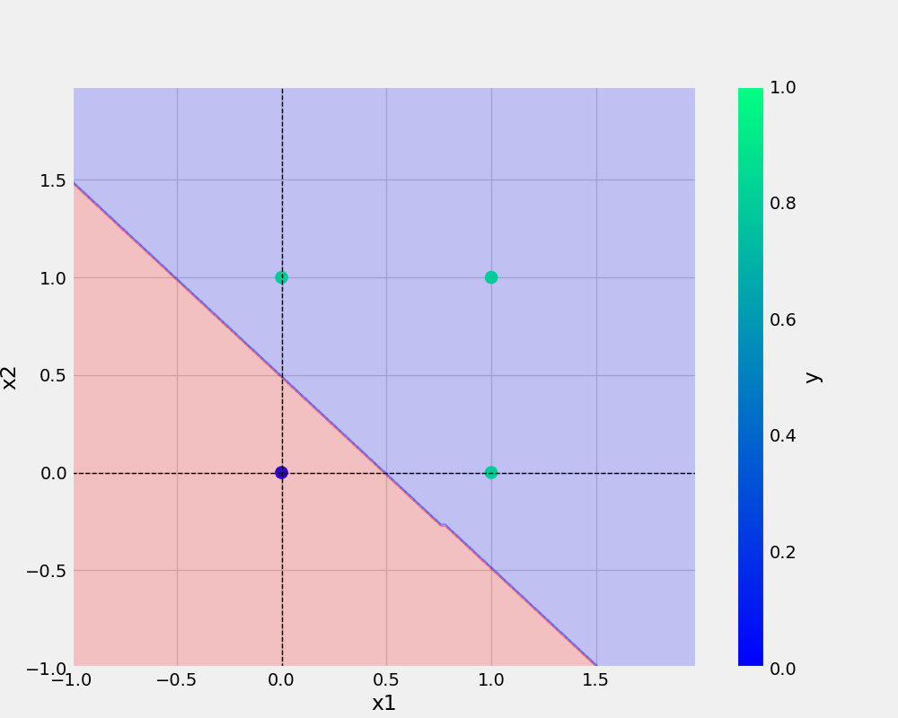

# oneNeuron
oneNeuron | Perceptron code implementation


# commands used -

```bash
git add . && git commit -m "name of commit" && git push origin main
```

```bash
cp Research\ Notebooks/demo.ipynb .
```
```
UrL: (https://guides.github.com/introduction/git-handbook/)
```
<a href="https://guides.github.com/introduction/git-handbook/">Visit W3Schools.com!</a>

## Add Image -




## Python code
```python
def main(data, modelName, plotName, eta, epochs):
    df = pd.DataFrame(data)
    logging.info(f"This is actual dataframe{df}")
    X, y = prepare_data(df)
    model = Perceptron(eta=eta, epochs=epochs)
    model.fit(X, y)
    _ = model.total_loss()
    save_model(model, filename=modelName)
    save_plot(df, plotName, model)

```

## Dataset
X1 | X2 | y
-|-|-
0|0|0
0|1|0
1|0|0
1|1|1

### 
* point 1
* poinr 2

1.point